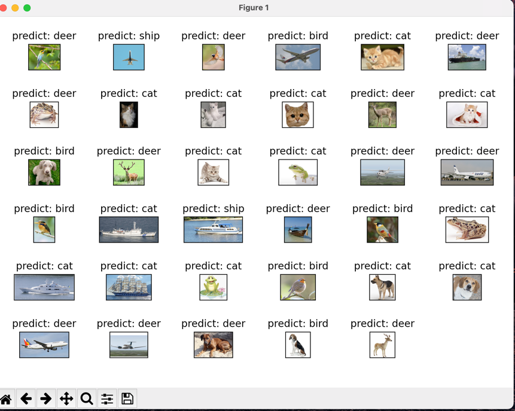
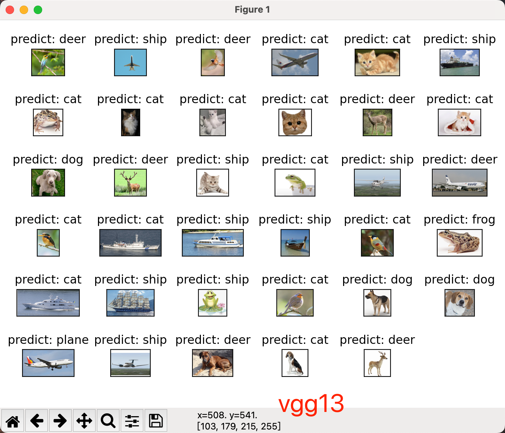

# cifar10_cnn（持续更新）
## v1.0: lr = 0.01, epoch= 50, acc =77%
### 使用了最基础的cnn，在小土堆的基础上对每次卷积之后添加一个Relu()激活函数。并且对数据进行了预处理。

## v2.0: lr = 0.01, epoch= 50, acc =77%
### 使测试数据集结果可视化。

## v2.1 
### 1.优化model模型,acc = 83%
#### 对输入数据集进行预处理，更新一些方法和参数。
    train_transform = transforms.Compose([
    transforms.RandomCrop(32, padding=4),
    transforms.RandomHorizontalFlip(),
    transforms.ToTensor(),
    transforms.Normalize((0.4914, 0.4822, 0.4465), (0.2023, 0.1994, 0.2010)),
    ])
#### 对测试数据集进行预处理
    test_transform = transforms.Compose([
    torchvision.transforms.ToTensor(),
    transforms.Normalize((0.4914, 0.4822, 0.4465), (0.2023, 0.1994, 0.2010)),
    ])

### 2.复现使用vgg13模型，acc = 90.72%
m1pro训练起来实在是费劲，所以只运行了60个epoch.

